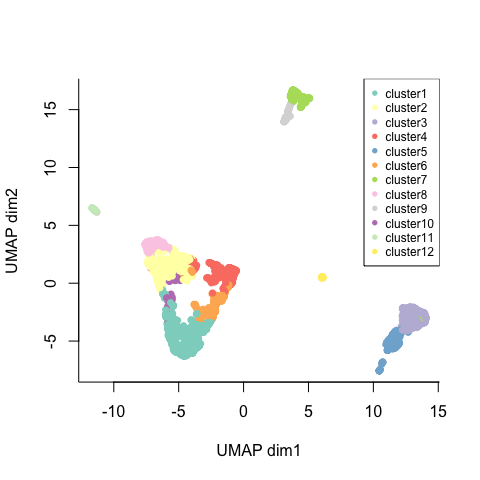
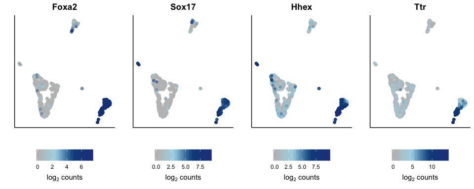
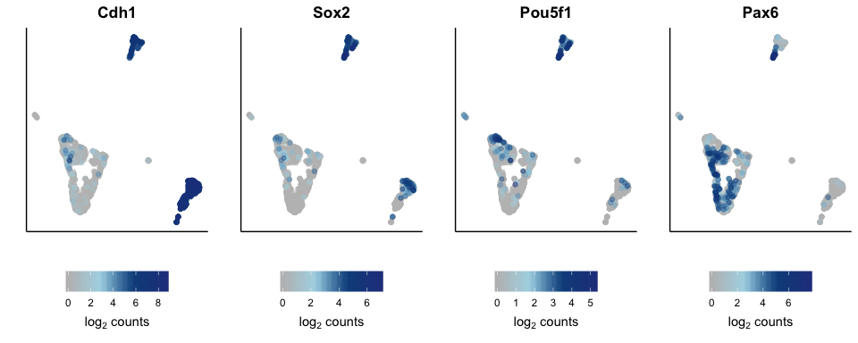
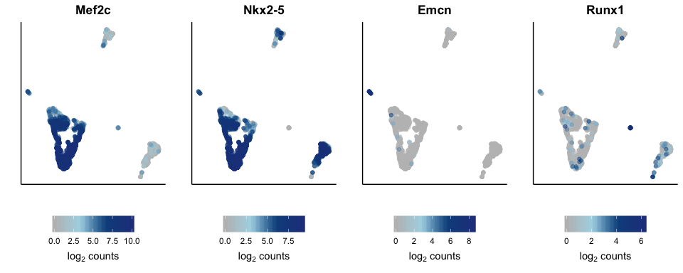
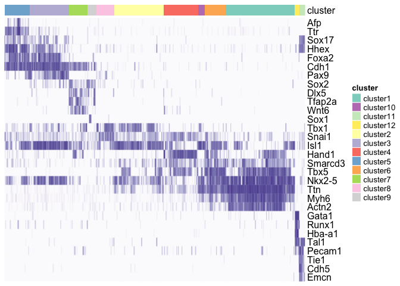
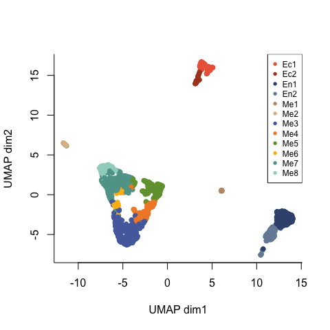

### Cluster annotation

Having clustered the data, we can annotate each subpopulation based on the expression of marker genes. We have explored the results from the marker analysis, and now also use well known genes from the literature to assign cell type identities.


```r
## normalised, batch corrected counts
sce <- readRDS(paste0(dir, "data/sce_goodQual.NORM.Rds"))

## add cluster annotation
clusters <- read.table(paste0(dir, "results/clusters_average_min40.tsv"), row.names = 1)
stopifnot(identical(colnames(sce), row.names(clusters)))
sce$cluster <- clusters$V2

clusters <- sce$cluster
names(clusters) <- colnames(sce)

## UMAP
umap <- read.table(paste0(dir, "results/umapCoords_corrected.tab"))
stopifnot(identical(colnames(sce), row.names(umap)))
reducedDim(sce, "UMAP") <- umap

plot(umap$x, umap$y, pch=16, col=clusters, bty="l", xlab="UMAP dim1", ylab="UMAP dim2")
legend("topright", legend = paste0("cluster", 1:12), col=1:12, pch=16, cex=0.75)
```

<!-- -->

Below are some well-known marker genes.

Endoderm:


```r
plotGeneOnUMAP <- function(umap=umap, data=sce, gene=gene){
  df <- data.frame(x=umap$x, y=umap$y, expr=logcounts(sce)[which(rowData(sce)$gene == gene),])
  df <- df[order(df$expr),]
  p <- ggplot(df, aes(x,y)) + geom_point(aes(colour=expr), alpha = 0.5, cex=1.5) + scale_colour_gradientn(colours = colorRampPalette(c("grey", "lightblue", "dodgerblue4", "royalblue4"))(100)) + ggtitle(gene) + xlab("") + ylab("") + labs(colour=expression('log'[2]*' counts')) + th + theme(axis.ticks.y = element_blank(), axis.text.x = element_blank(), axis.text.y = element_blank(), legend.position = "bottom", legend.text.align = 0.5, legend.title.align = 0.5) + guides(colour = guide_colorbar(title.position = "bottom"))
  return(p)
}

## endoderm
plots <- list()
plots[[1]] <- plotGeneOnUMAP(umap = umap, data = sce, gene = "Foxa2")
plots[[2]] <- plotGeneOnUMAP(umap = umap, data = sce, gene = "Sox17")
plots[[3]] <- plotGeneOnUMAP(umap = umap, data = sce, gene = "Hhex")
plots[[4]] <- plotGeneOnUMAP(umap = umap, data = sce, gene = "Ttr")

ggarrange(plotlist = plots, ncol = 4, nrow = 1)
```

<!-- -->

Ectoderm:


```r
## ectoderm
plots <- list()
plots[[1]] <- plotGeneOnUMAP(umap = umap, data = sce, gene = "Cdh1")
plots[[2]] <- plotGeneOnUMAP(umap = umap, data = sce, gene = "Sox2")
plots[[3]] <- plotGeneOnUMAP(umap = umap, data = sce, gene = "Pou5f1")
plots[[4]] <- plotGeneOnUMAP(umap = umap, data = sce, gene = "Pax6")

ggarrange(plotlist = plots, ncol = 4, nrow = 1)
```

<!-- -->

Mesoderm:


```r
## mesoderm
plots <- list()
plots[[1]] <- plotGeneOnUMAP(umap = umap, data = sce, gene = "Mef2c")
plots[[2]] <- plotGeneOnUMAP(umap = umap, data = sce, gene = "Nkx2-5")
plots[[3]] <- plotGeneOnUMAP(umap = umap, data = sce, gene = "Emcn")
plots[[4]] <- plotGeneOnUMAP(umap = umap, data = sce, gene = "Runx1")

ggarrange(plotlist = plots, ncol = 4, nrow = 1)
```

<!-- -->

Based on this, we can say that:

- Clusters 3 and 5 are endodermal cells.
- Clusters 7 and 9 are ectodermal cells.
- All other clusters are mesodermal cells:
    + Clusters 1, 2, 4, 6 and 10 are within the cardiac lineage.
    + Cluster 11: endothelial cells.
    + Cluster 12: blood cells.

And we can visualise these and other well-known markers as a heatmap:


```r
## known marker genes
markers <- c("Afp","Ttr","Sox17","Hhex","Foxa2","Cdh1","Pax9","Sox2","Dlx5","Tfap2a","Wnt6","Sox1","Tbx1","Snai1","Isl1","Hand1","Smarcd3","Tbx5","Nkx2-5","Ttn","Myh6","Actn2","Gata1","Runx1","Hba-a1","Tal1","Pecam1","Tie1","Cdh5","Emcn")
markers.ids <- row.names(rowData(sce)[match(markers,rowData(sce)$gene),])

## normalised counts
sce <- sce[,-which(sce$cluster==0)]
data <- logcounts(sce)[markers.ids,]
data <- t(apply(data, 1, function(x) x/max(x))) # standardise
row.names(data) <- rowData(sce)[row.names(data),]$gene

## hierarchical clustering of the rows
clust <- hclust(dist(t(data)))
order <- colnames(data)[rev(clust$order)]
## reorder by cluster
order <- clusters[order]
order <- c((order[order==5]), order[order==3], order[order==7], order[order==9], order[order==8], order[order==2], order[order==4], order[order==10], order[order==6], order[order==1], order[order==12], order[order==11])

## heatmap
cols <- brewer.pal(n=12, "Set3")
names(cols) <- paste0("cluster",1:12)
ha  <- HeatmapAnnotation(df = data.frame(cluster = paste0("cluster",sce[,names(order)]$cluster)), col = list(cluster = cols))

Heatmap(data[,names(order)], cluster_columns = FALSE, cluster_rows = FALSE, col=brewer.pal(n=9, name="Purples")[1:7], show_column_names = FALSE, top_annotation = ha, show_heatmap_legend = FALSE)
```

<!-- -->

Finally, we give each cluster a name that reflects their germ layer, and change the colours for each.


```r
## annotate the clusters
ann <- c("En1","En2","Ec1","Ec2",paste0("Me",1:8)) # En, Ec and Me for the three germ layers
names(ann) <- c(3, 5, 7, 9, 12, 11, 1, 6, 4, 10, 2, 8)
ann <- ann[order(as.numeric(names(ann)))]

## use specific colors for plotting
cols <- c(Ec1 = "#ec6646", Ec2 = "#af4424", En1 = "#3c537c", En2 = "#768ba5",
          Me1 = "#bf9a77", Me2 = "#debc95", Me3 = "#556dad", Me4 = "#f28a31", 
          Me5 = "#729f3c", Me6 = "#fbba14", Me7 = "#5fa398", Me8 = "#9FD3C5")

## add info to sce object
sce$clusterAnn <- ann[clusters]
sce$clusterCol <- cols[sce$clusterAnn]

order <- sample(1:ncol(sce), ncol(sce), replace = FALSE)
plot(reducedDim(sce)$x[order], reducedDim(sce)$y[order], pch=16, col=sce$clusterCol[order], bty="l", xlab="UMAP dim1", ylab="UMAP dim2")
legend("bottomright", legend = ann[order(ann)], col=cols[ann[order(ann)]], pch=16, cex=0.5)
```

<!-- -->


```r
## save sce object with cluster annotation and colour
saveRDS(sce, file=paste0(dir, "data/sce_goodQual.NORM.clusters.Rds"))
```


```r
sessionInfo()
```

```
## R version 3.6.1 (2019-07-05)
## Platform: x86_64-apple-darwin15.6.0 (64-bit)
## Running under: macOS High Sierra 10.13.6
## 
## Matrix products: default
## BLAS:   /Library/Frameworks/R.framework/Versions/3.6/Resources/lib/libRblas.0.dylib
## LAPACK: /Library/Frameworks/R.framework/Versions/3.6/Resources/lib/libRlapack.dylib
## 
## locale:
## [1] en_GB.UTF-8/en_GB.UTF-8/en_GB.UTF-8/C/en_GB.UTF-8/en_GB.UTF-8
## 
## attached base packages:
##  [1] grid      parallel  stats4    stats     graphics  grDevices utils    
##  [8] datasets  methods   base     
## 
## other attached packages:
##  [1] ComplexHeatmap_2.2.0        ggpubr_0.2.4               
##  [3] magrittr_1.5                ggplot2_3.2.1              
##  [5] RColorBrewer_1.1-2          scran_1.14.5               
##  [7] SingleCellExperiment_1.8.0  SummarizedExperiment_1.16.0
##  [9] DelayedArray_0.12.0         BiocParallel_1.20.0        
## [11] matrixStats_0.55.0          Biobase_2.46.0             
## [13] GenomicRanges_1.38.0        GenomeInfoDb_1.22.0        
## [15] IRanges_2.20.1              S4Vectors_0.24.1           
## [17] BiocGenerics_0.32.0        
## 
## loaded via a namespace (and not attached):
##  [1] viridis_0.5.1            edgeR_3.28.0             BiocSingular_1.2.0      
##  [4] viridisLite_0.3.0        DelayedMatrixStats_1.8.0 assertthat_0.2.1        
##  [7] statmod_1.4.32           dqrng_0.2.1              GenomeInfoDbData_1.2.2  
## [10] vipor_0.4.5              yaml_2.2.0               pillar_1.4.2            
## [13] lattice_0.20-38          glue_1.3.1               limma_3.42.0            
## [16] digest_0.6.23            XVector_0.26.0           ggsignif_0.6.0          
## [19] colorspace_1.4-1         cowplot_1.0.0            htmltools_0.4.0         
## [22] Matrix_1.2-18            pkgconfig_2.0.3          GetoptLong_0.1.7        
## [25] zlibbioc_1.32.0          purrr_0.3.3              scales_1.1.0            
## [28] tibble_2.1.3             farver_2.0.1             withr_2.1.2             
## [31] lazyeval_0.2.2           crayon_1.3.4             evaluate_0.14           
## [34] beeswarm_0.2.3           tools_3.6.1              scater_1.14.4           
## [37] GlobalOptions_0.1.1      lifecycle_0.1.0          stringr_1.4.0           
## [40] munsell_0.5.0            locfit_1.5-9.1           cluster_2.1.0           
## [43] irlba_2.3.3              compiler_3.6.1           rsvd_1.0.2              
## [46] rlang_0.4.2              RCurl_1.95-4.12          BiocNeighbors_1.4.1     
## [49] rstudioapi_0.10          circlize_0.4.8           rjson_0.2.20            
## [52] igraph_1.2.4.2           labeling_0.3             bitops_1.0-6            
## [55] rmarkdown_1.18           gtable_0.3.0             R6_2.4.1                
## [58] gridExtra_2.3            knitr_1.26               dplyr_0.8.3             
## [61] clue_0.3-57              shape_1.4.4              stringi_1.4.3           
## [64] ggbeeswarm_0.6.0         Rcpp_1.0.3               png_0.1-7               
## [67] tidyselect_0.2.5         xfun_0.11
```

